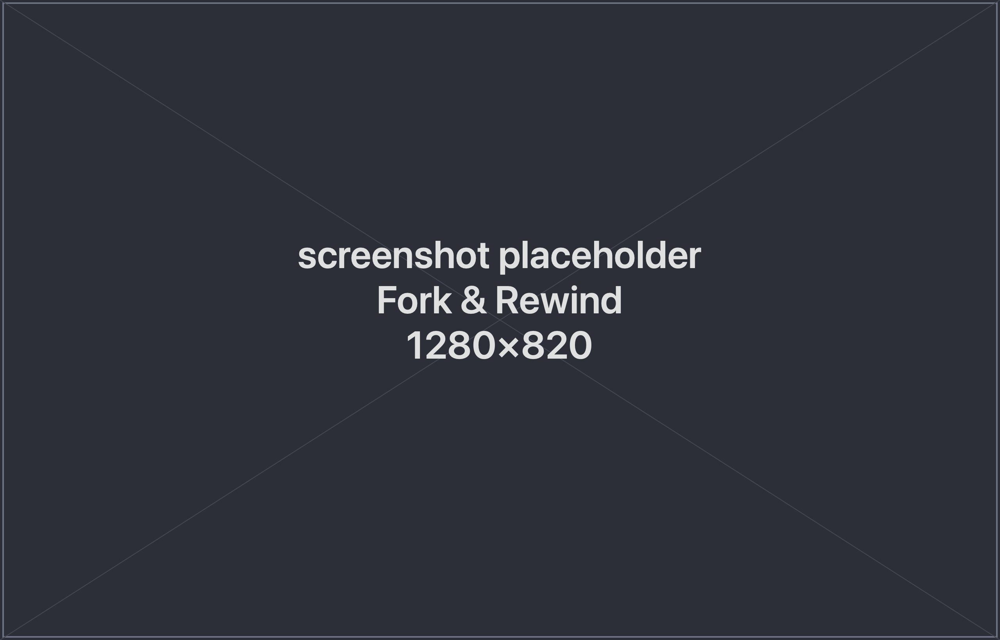
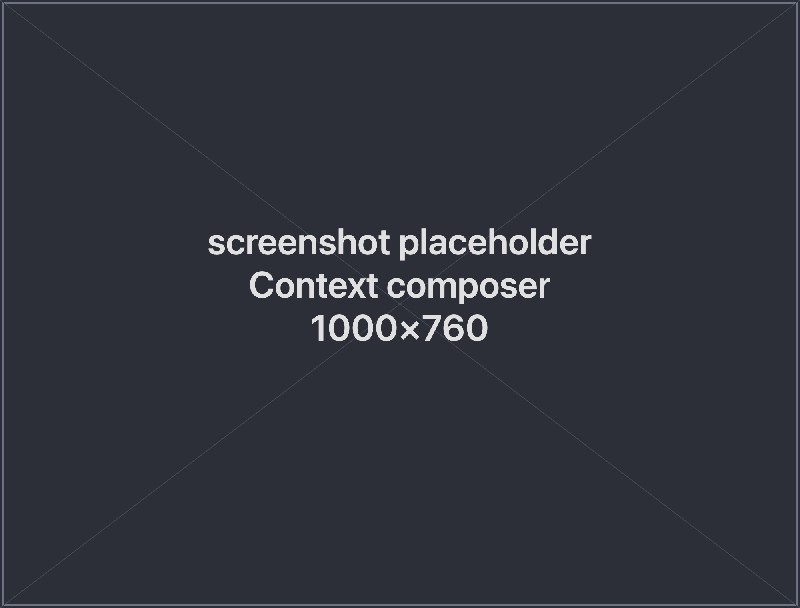

<div align="center">

# spwn

**Run Claude Code in parallel — every session its own conversation, its own git branch, its own live preview.**

Fork a coding session the moment an idea splits: spwn branches the *AI conversation* **and** the *code* together, so you can explore three approaches at once instead of babysitting one linear chat.

[](https://github.com/spwn-gg/spwn/releases/latest)
[](#download)
[](LICENSE)
[](https://spwn-gg.github.io/spwn/)


</div>

Three features, one idea: **exploration should be cheap, isolated, and disposable.** Two of
them are what make spwn different from a terminal full of Claude tabs — **session branching**
and a **per-session hook system**, which is also how a session gets its own container — so
they lead below.

---

## Download

spwn is a native **macOS** app (Apple Silicon or Intel).

1. Grab **`spwn.app.tar.gz`** from the **[latest release](https://github.com/spwn-gg/spwn/releases/latest)**, unpack it, and drag `spwn.app` into `/Applications`.
2. First launch: releases are ad-hoc signed but not notarized, so macOS quarantines the
   download once. Double-click, then **System Settings → Privacy & Security → Open Anyway** —
   or run `xattr -dr com.apple.quarantine "/Applications/spwn.app"`. The in-app auto-updater
   never trips this again.

**Requires** an authenticated **`claude` CLI** on your `PATH` — spwn uses your existing Claude
login, and never re-uploads or proxies anything. Prefer to build it yourself? See **[BUILD.md](BUILD.md)**.

Full guide: **[Installation](https://spwn-gg.github.io/spwn/getting-started/installation/)** ·
**[Quick Start](https://spwn-gg.github.io/spwn/getting-started/quick-start/)**

---

## ⑂ Session branching



A single Claude conversation is a straight line. Real work isn't — you want to chase an idea
down one path, back out when it stalls, try a different angle, and bring the good parts back
together. A linear chat forces you to either pollute one context with dead ends or scatter your
work across sessions you'll never find again.

**Fork** turns that into one gesture. From any point in a session, spwn branches the
**conversation and the code at the same time** — the child inherits the parent's full history
(via the Agent SDK's `forkSession`) *and* gets its own git branch in its own worktree, forked
from the parent's. The original keeps running, untouched.

- **Branch the conversation *and* the code, together.** Not just `git branch` on files — the
  entire reasoning that got you here comes along. The lineage is drawn as a tree: forks nest
  under the session they came from.
- **Instantly buildable branches.** A plain worktree has no `node_modules` or `target`, so you
  can't build. spwn **copy-on-write clones** heavy gitignored dirs into every worktree, so an
  agent builds, tests, and runs from the first moment — no cold reinstall, near-zero disk.
- **True parallelism, zero context-switch cost.** Each session is a separate checkout on its
  own `spwn/<id>` branch. Kick off several autonomous sessions at once; none of them clobbers
  another or your main working tree. Switching tabs is a pure focus change — nothing on disk moves.
- **Mergeable history for free.** Every turn auto-commits on the session branch, so there's
  never anything to reconstruct at the end. Merge back with one click, or plain `git merge spwn/<id>`.
- **Rewind, don't just fork.** The **Timeline** rolls a session back to an earlier turn —
  conversation, files, or both — restored from APFS checkpoints.
- **Disposable and safe.** Delete a session and spwn removes *both* the worktree and its branch,
  so they never pile up — and if you'd lose unmerged commits or uncommitted changes, the confirm
  dialog names exactly what, first.

> Explore many branches cheaply, then merge what worked into a focused session — instead of
> fighting one ever-growing linear chat.

📖 [Fork & Timeline](https://spwn-gg.github.io/spwn/guides/fork-and-rewind/) ·
[Branches & merging](https://spwn-gg.github.io/spwn/guides/branches-and-merging/)

## ⚓ The hook system

Because each session lives on its own branch in its own worktree, it's the natural place to wire
up per-session setup and teardown — start a dev server, seed a database, spin up containers, copy
secrets, then clean it all up on delete. spwn does this the unix way: **one shell script per
lifecycle event**, with the session's details injected as environment variables. spwn just runs
the script — Docker, plain shell, anything. It has no opinion about what it does.

```sh
# .spwn/hooks/session-created.d/20-setup.sh — runs when a new session's worktree is ready
npm install --prefer-offline                         # deps land in the COW-cloned node_modules
cp "$SPWN_PROJECT_DIR/.env" "$SPWN_WORKTREE/.env"     # bring gitignored secrets into the branch
echo "ready on $SPWN_BRANCH"
```

- **Four lifecycle events** — `session-created`, `session-ready`, `session-turn`, and
  `session-deleted` — each handed the session's context: `SPWN_WORKTREE`, `SPWN_BRANCH`,
  `SPWN_SESSION_ID`, `SPWN_PROJECT_DIR`, and more.
- **spwn runs on its own hooks.** Worktree create/remove, per-turn commits, and checkpoints
  aren't hardcoded — they ship as *default* scripts in `~/.spwn/hooks/` that you can read,
  reorder, extend, or delete. What spwn does to your session is fully in view, and yours to change.
- **Global + repo, single file or folder.** Put scripts in `~/.spwn/hooks/` (every project) or a
  committed `.spwn/hooks/` (travels with the checkout, applies to just that repo). Each event is a
  lone `<event>.sh` or a numbered `<event>.d/` folder whose steps compose — drop in `50-my-setup.sh`
  without touching spwn's own scripts.
- **Interactive and reportable.** A hook can pause to ask the user a question (`spwn prompt`, a
  blocking picker in the UI) and hand structured values back to spwn (`::spwn:set:: key=value`).
- **A Hooks panel per session.** See every event's discovered scripts with pass/fail dots and
  captured output, and re-fire any event by hand. A failing hook shows a one-line advisory — it
  never blocks the session.

📖 [Hooks reference](https://spwn-gg.github.io/spwn/reference/hooks/) · runnable
[`examples/hooks/`](examples/hooks/) with an 8-recipe cookbook (preview env, seed DB, copy secrets, teardown, …).

## 📦 Per-session dev environments

A session is isolated in *files* — its own branch, its own worktree — but by default it still
builds and tests against **your** machine's toolchain. So parallel sessions share one Node, one
Python, one set of ports, and a session that needs a different stack has nowhere to go.

A hook can hand spwn an **environment** instead, and spwn runs the session inside it: the agent's
TUI, its shells, its builds, its tests. One line does it.

```sh
# .spwn/hooks/session-created.d/20-container.sh — abridged; the runnable example also
# mounts the repo's .git (so git works in there) and ~/.claude (so your login does)
docker run -d --name "spwn-$SPWN_TERMINAL_ID" \
  -v "$SPWN_WORKTREE:$SPWN_WORKTREE" -w "$SPWN_WORKTREE" my-dev-image sleep infinity

echo "::spwn:set:: exec=docker exec -it -w $SPWN_WORKTREE spwn-$SPWN_TERMINAL_ID"
```

- **spwn ships no Docker code.** It prepends the prefix your hook reported to each pane's argv and
  never looks inside it — Docker, Podman, a VM, an SSH host, whatever you wired up. spwn *had* a
  built-in compose integration once; it was removed for being too opinionated, and this replaces it
  with the same `::spwn:set::` callback that already lets a hook create the worktree.
- **The environment is isolated; your files aren't.** The worktree is bind-mounted at its *identical
  absolute path*, so your editor, host-side `git`, per-turn commits, and the Timeline all keep
  working exactly as before. What's isolated is the toolchain — not your ability to see the work.
- **Different stacks, side by side.** One session on Node 18, another on Node 22, a third with a
  system library you'd rather not install. Install something in one and the others never see it.
- **Share what's expensive, isolate what isn't.** The [services
  recipe](https://spwn-gg.github.io/spwn/cookbook/hooks/#per-session-dev-environment-with-services)
  runs one shared database *server* with a separate database per session — ten parallel sessions
  don't mean ten postgres processes, and they still can't clobber each other's rows.
- **Torn down with the session.** `session-deleted` fires before the worktree goes, so the container
  leaves with it — the same delete that removes the branch.

> Your laptop stays clean, and "works on my machine" stops being a property of the machine.

📖 [Running a session somewhere else](https://spwn-gg.github.io/spwn/reference/hooks/#running-a-session-somewhere-else) ·
runnable [`docker-env/`](examples/hooks/docker-env/) and [`dev-env-services/`](examples/hooks/dev-env-services/)

---

## More of what spwn does

**Compose across sessions → Inject.** Every project has a composable context space: notes, files,
and individual turns cherry-picked from *any* of your sessions. **Inject** assembles those blocks
into a first message and seeds a fresh Claude session with it — a merge layer for *insight*, not
just code (`▦` on a project → add blocks → Inject).



**Choose where worktrees live.** Configurable in **Settings → Session worktree location**; applies
to new sessions only.

| Option | Location | Notes |
|--------|----------|-------|
| **Sibling** (default) | `<repo-parent>/.<repo-name>-worktrees/<id>/` | A dot-prefixed folder *beside* the repo, outside the working tree — builds, watchers, and IDE indexers never recurse into it. |
| **Inside repo** | `<repo>/.spwn/worktrees/<id>/` | Registered in `.git/info/exclude` (the tracked `.gitignore` is untouched). |
| **App data** | `…/com.markbarta.spwn/worktrees/<id>/` | Under the app data dir, away from your repos entirely. |

**Projects & terminals.** A **project** is a name + working directory that groups terminals
(persisted to `app_data_dir/projects.json`; spwn owns them, they're not derived from Claude's
dirs). A **terminal** is a plain **shell** (default) or a **Claude** session, arranged in tabbed
panes. A built-in **scheduler** can run read-only tasks on a cron and surface results as
attention-flagged sessions.

## How it works

A **CLI + web server**: one **Rust** binary (git worktrees, checkpoints, hooks, scheduler)
serving HTTP + a WebSocket, with the **Svelte** UI embedded in it and opened in your browser.
Agents run as **TUIs in rmux panes** — the same `claude` you'd run in a terminal, driven and
watched by spwn. It only **reads/watches** (never writes) `~/.claude/projects/` and
`~/.claude.json`.

**On disk** (`~/Library/Application Support/com.markbarta.spwn/`): `projects.json`,
`settings.json`, `checkpoints/<session_id>/` (APFS copy-on-write code-undo snapshots), and — for
the *App data* worktree layout — `worktrees/`.

---

## Roadmap

Where spwn is headed next:

- **Other agents** — bring the same branch-conversation-and-code model to coding agents beyond Claude Code.
- **Remote sessions** — run sessions on a remote machine while driving them from the local app.
- **Export sessions** — take a session's conversation and work out of spwn in a portable format.
- **Cost tracking per session** — see token spend broken down per session across your branches.

---

## Docs · Build · License

- **Documentation** — <https://spwn-gg.github.io/spwn/>
- **Build from source / contribute** — [BUILD.md](BUILD.md)
- **License** — [Apache-2.0](LICENSE)
