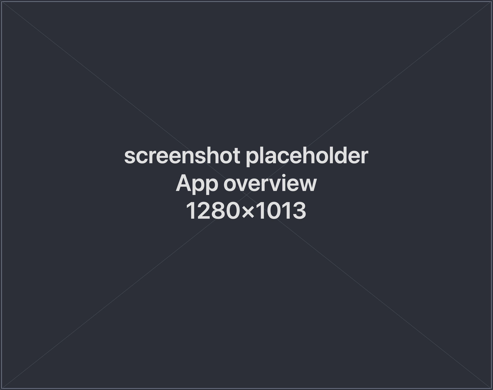

**spwn** is a desktop app that organizes your Claude Code work into projects, gives
each one a reusable context, and keeps your sessions running in the background.

## The idea

Claude Code runs one session at a time in a terminal, and every session starts fresh.
That means re-explaining your project, losing running work when a window closes, and
having no easy way to carry a good answer from one session into the next. spwn adds a
layer on top that solves this:

1. **A reusable context for each project.** Collect the notes, files, and useful
   answers that matter for a project, then start a new session already primed with
   all of it — instead of typing the same background every time.
2. **Sessions that stick around.** Your sessions are grouped into projects and keep
   running even after you close the app, so quitting spwn never kills your work.
3. **Runs that happen on their own.** Schedule read-only tasks to run against a
   project on a daily or weekly cadence, and read the results when you're back.

## Core concepts

- **Project** — a name and a folder that groups everything you're doing there: your
  sessions and your context. You decide what's a project and what it's called.
- **Session** — a **shell** or a **Claude** session you open inside a project. Each
  one keeps running in the background and is right where you left it when you reopen
  the app.
- **Claude session** — work with Claude in a clean, scrollable conversation, with the
  full Claude experience (every slash-command and tool prompt) available right beside
  it.
- **Context** — the per-project collection of notes, files, and saved answers you can
  **inject** into a new session as its starting point.
- **Scheduled task** — a read-only task Claude runs against a project on a schedule,
  reusing that project's context, so a report or review is waiting for you.

## Next

- [Installation](/spwn/getting-started/installation/) — get spwn running on your Mac.
- [Quick Start](/spwn/getting-started/quick-start/) — create a project and seed your first session.
