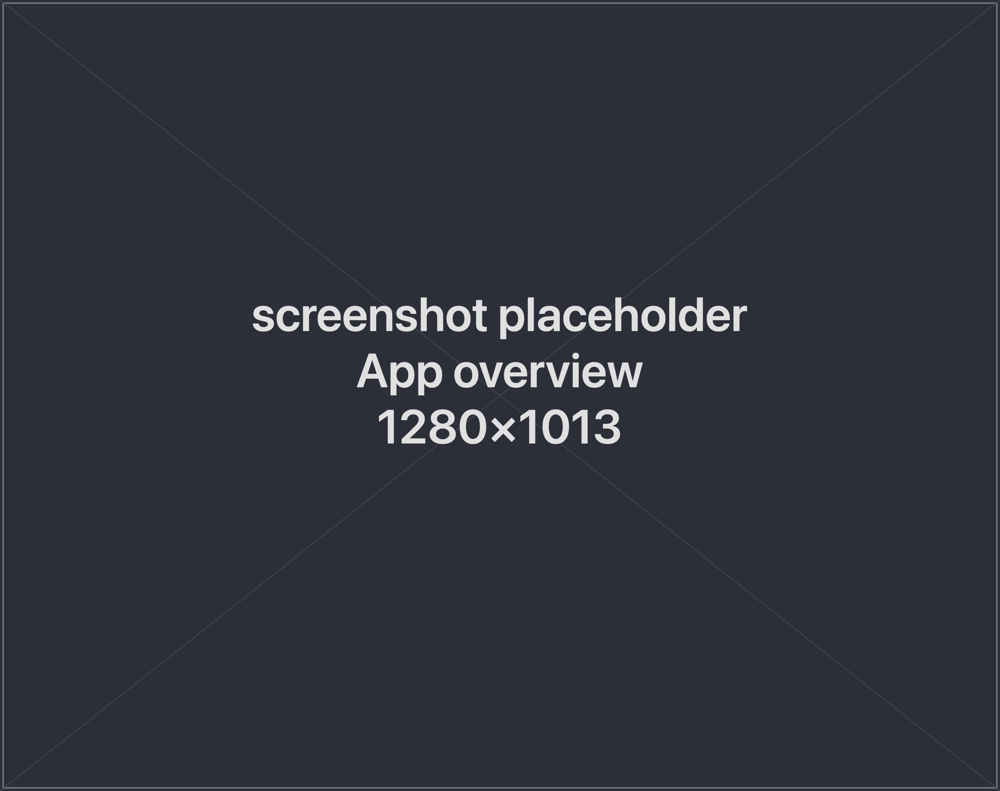

**spwn** is a native macOS app for running Claude Code agents **in parallel**. Every
Claude session works on its own git branch, in its own isolated copy of your code — so
you can explore several approaches at once and merge back only what worked.

## The problem

A Claude Code conversation is a straight line in a single terminal. Real work isn't:

- You want to try an idea one way, back out, and try it another — without losing the
  first attempt.
- You want a few agents working at once, not one at a time.
- You lose running work the moment a terminal window closes.
- You re-explain the same project background to every fresh session.

You *can* stitch this together yourself with git worktrees, terminal multiplexers, and a
notes file. spwn is what that would become if you built it properly — and then didn't
have to maintain it.

## The idea

spwn adds a thin layer over your existing Claude Code setup that makes parallel,
disposable exploration the default:

1. **A branch and workspace per session.** Each Claude session runs on its own
   `cm/…` git branch in its own worktree, copy-on-write seeded with your build folders
   so it's ready to build immediately. Sessions run side by side without clashing.
2. **Merge back only the winners.** Every session commits as it goes, so its branch is
   always real, mergeable history. Merge with a click or with plain `git` — nothing
   lands on its own.
3. **Explore without losing work.** Fork a session to branch off, or use the Timeline
   to return to an earlier point. Sessions keep running after you quit the app.
4. **Start primed, not cold.** Collect the notes, files, and best answers for a project
   in its **Merge tray**, then Inject them as the first message of a new session.
5. **Runs that happen on their own.** Schedule read-only tasks against a project and
   read the results when you're back.

## Core concepts

- **Project** — a name and a folder that groups everything you do there: its sessions,
  shells, Merge tray, and scheduled tasks. You decide what's a project and what it's
  called.
- **Session** — an isolated Claude workspace: its own conversation *and* its own copy of
  your code, on its own git branch. This is the unit you explore, fork, and merge.
- **Shell** — a plain terminal in the project folder. No conversation, no branch — just
  a shell for git, builds, and tests.
- **Merge tray** — the per-project collection of notes, files, and saved turns you
  **Inject** into a new session as its starting point.
- **Fork / Timeline** — branch a session into a new one (**Fork**), or return the
  current one to an earlier point (**Timeline**).
- **Merge** — bring a session's committed work back into its base branch with git.
- **Scheduled task** — a read-only task Claude runs against a project on a schedule,
  reusing the project's Merge tray.

## Next

- [Installation](/spwn/getting-started/installation/) — get spwn running on your Mac.
- [Quick Start](/spwn/getting-started/quick-start/) — create a project and run your first parallel sessions.
