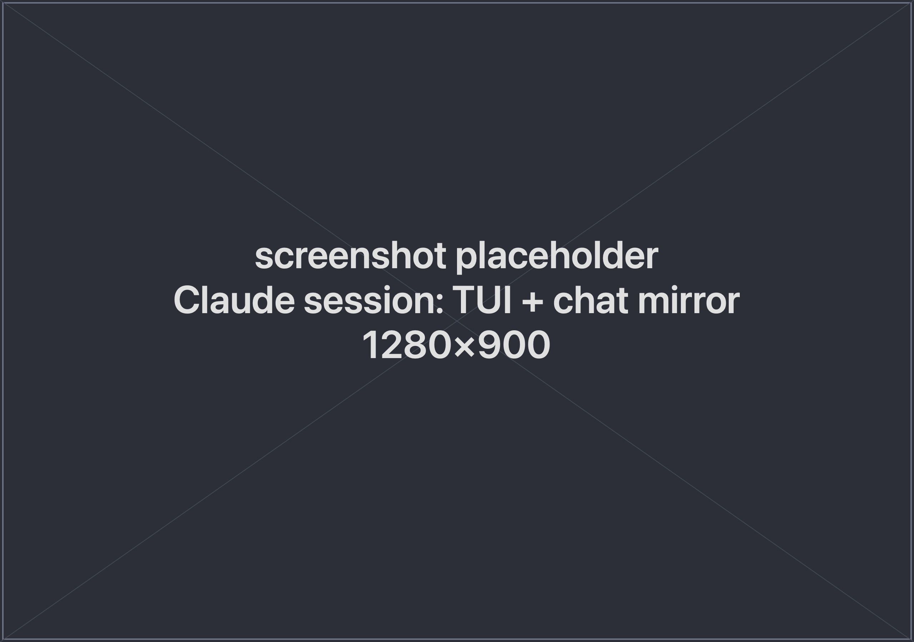

A **Claude session** is the centerpiece of spwn. You get a clean, readable
conversation on one side and the complete Claude Code experience on the other — so
you can read and work comfortably without giving anything up.

## The full Claude experience

The working side is Claude Code itself, not a stripped-down copy. That means:

- You **type to Claude** directly.
- **Every slash-command** works.
- **Tool prompts** — permission requests, pickers — appear and are answered right
  there, exactly as they would in the terminal.

Nothing is reimplemented or held back; you get everything Claude Code can do.

In a git project, each session also works on **its own branch**, isolated from the
others — so you can run several at once and merge the results back. See
[Parallel Sessions](/spwn/guides/parallel-sessions/).

## The conversation view

Beside it, spwn shows a clean, scrollable view of the conversation. It stays in sync
with the session and lets you **select individual answers** to reuse.

This is where you **save answers** into a project's
[context](/spwn/guides/context-composer/) — so a useful exchange from one session can
seed the next — and where the [Fork and Rewind](/spwn/guides/fork-and-rewind/)
actions live.

## Seeding a session with context

Instead of starting cold, you can **inject** a project's composed context as the
first message of a new session. See [Composing Context](/spwn/guides/context-composer/).

## Next

- [Fork & Rewind](/spwn/guides/fork-and-rewind/)
- [Parallel Sessions](/spwn/guides/parallel-sessions/)
- [Composing Context](/spwn/guides/context-composer/)
