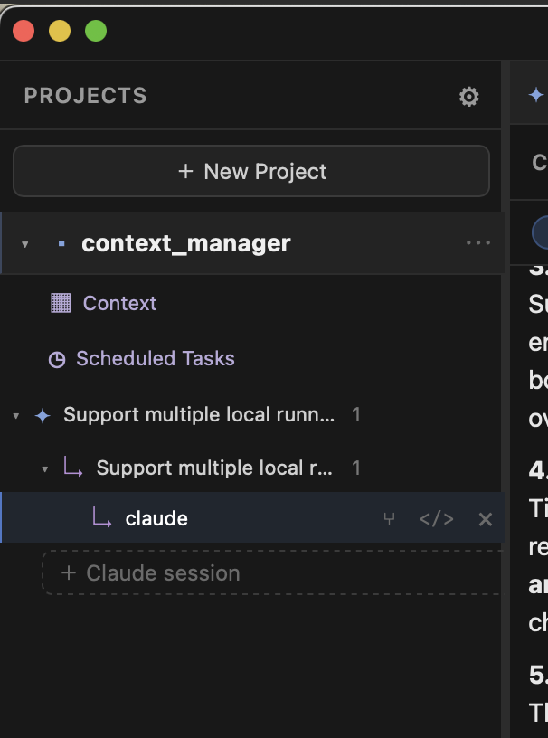

spwn gives you two ways to move through a session's history: **Fork** to branch into
a new session, and **Rewind** to roll the current one back to an earlier point.

## Fork

**Fork** branches a session into a new one, opened in its own tab and shown nested
under the original in the sidebar so you can see where it came from.

Use Fork when you want to try a different direction without abandoning the
conversation you have — both sessions continue to exist and run independently. It's
ideal for "what if we tried it this other way?" moments: branch, explore, and keep
whichever result you like.

## Rewind

**Rewind** rolls a session back to an earlier checkpoint. You pick the point to
return to, and the session continues from there.

Use Rewind when a session has gone down an unproductive path and you'd rather back up
and retry than start over.

## How they differ

| | Fork | Rewind |
|---|---|---|
| **Effect** | Creates a **new** session branched from a point | Rolls the **current** session back |
| **Original session** | Kept, runs in parallel | Rolled back in place |
| **Use it when** | You want to explore an alternative and keep both | You want to back up and retry |

## Next

- [Claude Sessions](/spwn/guides/claude-sessions/)
- [Composing Context](/spwn/guides/context-composer/)
