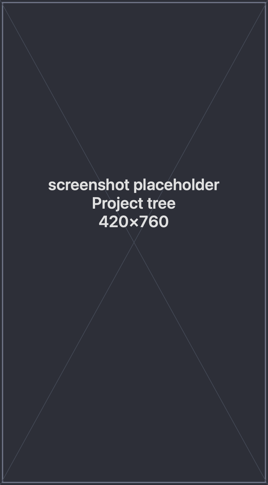

A **project** is the top-level unit of organization in spwn: a **name** plus a
**folder** that groups the sessions you open inside it. You decide what's a project
and what it's called.

## Create a project

1. Click **New Project** at the top of the sidebar.
2. Give it a name.
3. Pick the folder you want to work in — this is where Claude reads and writes files
   for the project.

That's it. The project appears in the sidebar, ready for you to open sessions,
compose context, and schedule tasks.

## The project tree

The sidebar lists your projects and, under each, the sessions you've opened. It
updates automatically as sessions start — including ones created by
[forking](/spwn/guides/fork-and-rewind/) — so you never have to refresh it.

Each project also has a **Context** view and a **Scheduled Tasks** view, reachable
from its row in the tree.

## Working folder

A project's folder is where its sessions run. For a Claude session, that's the
folder Claude works in — so it reads and writes exactly the files you'd expect for
that project. Keeping one project per folder keeps each project's work, context, and
sessions cleanly separated.

## Next

- [Sessions](/spwn/guides/terminals/) — open shells and Claude sessions.
- [Composing Context](/spwn/guides/context-composer/) — build a reusable context per project.
- [Scheduled Tasks](/spwn/guides/scheduled-tasks/) — run tasks on a schedule.
