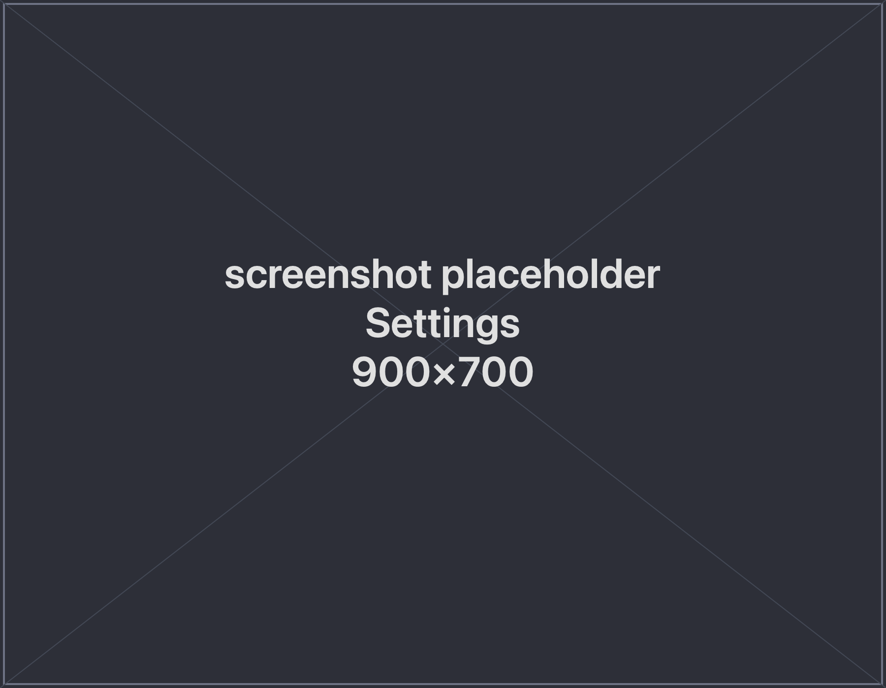

Open **Settings** to configure how spwn finds Claude and how it updates.

## Claude CLI

spwn uses your own authenticated `claude` command. It **auto-detects** it in the
usual locations and shows the path it found. If your `claude` lives somewhere
unusual, set the path here to point spwn at it.

Because spwn uses your existing Claude login, there's nothing else to sign in to —
and nothing is re-uploaded or proxied. See
[How it works & your data](/spwn/reference/architecture/) for what spwn touches.

## Updates

spwn has a built-in updater. When a new release is available, an update banner
appears — apply it and spwn relaunches on the new version. Updates it installs don't
trigger the macOS security prompt you see on a first download from GitHub (see
[Installation](/spwn/getting-started/installation/)).

## Staying available for scheduled tasks

[Scheduled tasks](/spwn/guides/scheduled-tasks/) only run while spwn is running, so
spwn stays available in the **menu bar** when you close its window. Open it again
from the menu-bar icon, or quit fully from that icon's menu.
